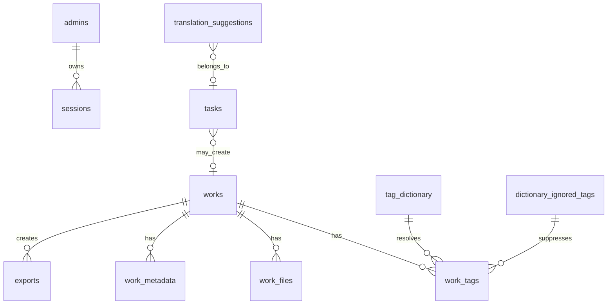
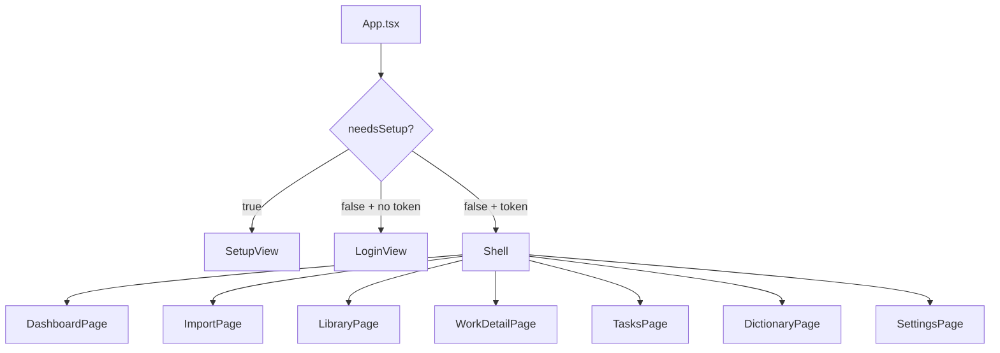
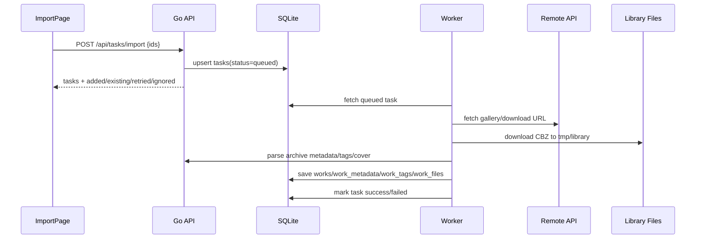
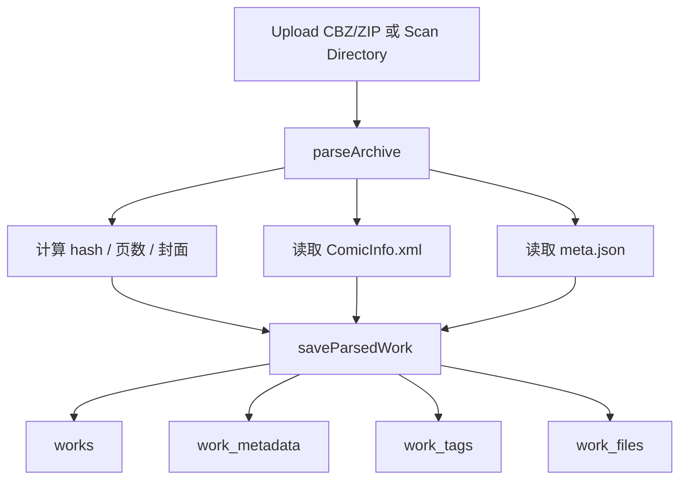
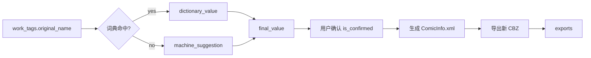
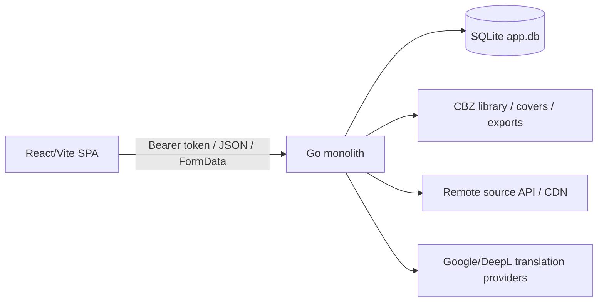

# Project Map — NH Archive

> 目的：帮助维护者快速理解 `nhentai-archive` 的代码边界、运行链路、数据模型、页面结构和常见改动入口。

## 1. 项目定位

`nhentai-archive` 是一个**单管理员本地 CBZ 元数据管理工作台**。当前架构是 Go 单体服务：一个容器、一个进程，无 Nginx；Go 后端同时提供 `/api` 接口和 React 静态前端。

核心能力：

- 首次运行创建管理员账户。
- 远程搜索、详情预览、批量 ID 导入、相关作品查看。
- 本地 CBZ/ZIP 上传、目录扫描、hash 去重、读取 `ComicInfo.xml` / `meta.json`、抽取本地封面。
- 管理作品、工作元数据、标签、词典、翻译建议与导出记录。
- 导出新 CBZ 时写入确认后的 `ComicInfo.xml`，默认保留原始 `meta.json`。
- 网页设置中配置 API key 与翻译服务密钥，密钥加密保存且不回显明文。

明确不包含：验证码、Cloudflare、登录绕过、反爬绕过、cookie 抓取或权限绕过逻辑。

## 2. 顶层结构

```text
.
├── README.md                 # 项目说明、部署、本地开发入口
├── Dockerfile                # 多阶段构建：frontend -> go-builder -> alpine runtime
├── docker-compose.yml        # 单 app 服务、端口映射、数据卷、运行环境变量
├── go.mod / go.sum           # Go 模块；主要数据库依赖为 modernc.org/sqlite
├── server/
│   └── main.go               # Go 单体后端：配置、路由、DB、任务、导入、导出、翻译、静态文件
└── frontend/
    ├── package.json          # Vite + React + TypeScript 构建脚本与依赖
    └── src/
        ├── App.tsx           # 前端状态、路由、页面装配、轮询刷新
        ├── lib/api.ts        # 统一 API client 与前端数据类型
        ├── components/       # 登录、设置、布局、通用 UI 组件
        └── views/            # Dashboard / Import / Library / WorkDetail / Tasks / Dictionary / Settings
```

> 注意：当前已知核心后端集中在 `server/main.go`，未来若文件继续增长，建议按领域拆分。

## 3. 运行与部署链路

### 3.1 Docker 构建链路

```mermaid
flowchart TD
  A[frontend/package*.json] --> B[node:22-alpine npm ci]
  C[frontend/] --> D[npm run build]
  E[go.mod/go.sum] --> F[golang:1.23-alpine go mod download]
  G[server/] --> H[CGO_ENABLED=0 go build ./server]
  D --> I[alpine:3.21 runtime]
  H --> I
  I --> J[/app/nhentai-archive + /app/public]
```

Dockerfile 使用三阶段构建：先构建前端，再构建 Go 二进制，最后把二进制和 `frontend/dist` 放入 Alpine 运行镜像。

### 3.2 Compose 运行链路

```mermaid
flowchart LR
  User[Browser] -->|PUBLIC_PORT 默认 5413| Host[Host Port]
  Host -->|映射到 8080| App[app container]
  App --> API[/api]
  App --> Static[React static files]
  App --> Data[/app/data]
  Data --> DB[(app.db)]
  Data --> Library[/library]
```

主要运行变量：

| 变量 | 作用 | 默认值 / 说明 |
|---|---|---|
| `PUBLIC_PORT` | 宿主机访问端口 | `5413` |
| `BIND_ADDR` | 宿主机绑定地址 | `0.0.0.0`，反代时可设 `127.0.0.1` |
| `HOST_DATA_DIR` | 宿主机持久化目录 | `./data` |
| `SECRET_KEY` | 服务端加密密钥 | 改动后需要重填网页保存的 API key |
| `DOWNLOAD_CONCURRENCY` | 下载并发 | `2` |
| `REQUEST_INTERVAL_MS` | 远端请求间隔 | `900` |
| `TARGET_LANGUAGE` | 默认翻译目标语言 | `zh-CN` |

容器内关键路径：

```text
/app/data/app.db
/app/data/library
/app/data/library/.tmp
/app/public
```

## 4. 后端地图：`server/main.go`

### 4.1 启动流程

```mermaid
flowchart TD
  A[loadConfig] --> B[创建 library / .tmp / DB 目录]
  B --> C[sql.Open sqlite]
  C --> D[App{cfg, db, crypto, started}]
  D --> E[initDB]
  E --> F[NewNHClient]
  F --> G[NewWorker]
  G --> H[worker.Start]
  H --> I[http.ListenAndServe routes]
```

核心对象：

| 对象 | 责任 |
|---|---|
| `Config` | 地址、数据目录、数据库路径、资料库路径、静态目录、密钥、请求超时/间隔/重试、下载并发、会话 TTL、UA、目标语言 |
| `App` | 聚合配置、SQLite、密钥加密、远端客户端、后台 worker、启动时间 |
| `SecretBox` | 对网页设置保存的 secrets 做加密/解密 |
| `NHClient` | 远端 API、CDN 配置、搜索、详情、下载 URL、相关作品等 |
| `Worker` | 后台处理导入、下载、解析、状态更新 |

### 4.2 API 路由分区

```text
公开/初始化
├── GET  /api/health
├── GET  /api/setup/status
├── POST /api/setup/admin
└── POST /api/auth/login

账号与设置
├── /api/account/password
├── /api/status
├── /api/settings
├── /api/settings/export
├── /api/settings/secrets
├── /api/settings/test-connection
└── /api/logs

远端来源
├── /api/sources/nhentai/search
├── /api/sources/nhentai/test
├── /api/sources/nhentai/galleries/{id}
├── /api/sources/nhentai/galleries/{id}/import
└── /api/sources/nhentai/galleries/{id}/related

本地导入
├── /api/local/upload
├── /api/local/scan
└── /api/local/scan/status

作品库
├── /api/works
├── /api/works/{id}
├── /api/works/{id}/cover
├── /api/works/{id}/metadata
├── /api/works/{id}/tags/...
├── /api/works/{id}/export
└── /api/works/bulk-action

任务与导出
├── /api/tasks/import
├── /api/tasks/retry-failed
├── /api/tasks/clear-completed
├── /api/tasks
├── /api/tasks/{id}/...
├── /api/exports
└── /api/exports/{id}/...

词典与建议
├── /api/dictionary
├── /api/dictionary/bulk
├── /api/dictionary/tags/...
└── /api/suggestions/...

前端
└── /             # React 静态文件 fallback
```

所有主要业务 API 通过 `a.auth(...)` 保护；公开接口主要用于健康检查、首次初始化与登录。

### 4.3 数据模型



| 表 | 用途 |
|---|---|
| `admins` | 单管理员账户 |
| `sessions` | Bearer token 会话，按 token hash 存储 |
| `settings` | 普通配置项 |
| `secrets` | 加密保存的 API key / 翻译密钥 |
| `tasks` | 导入、扫描、解析、导出等任务状态与进度 |
| `works` | 作品主表，含来源、标题、CBZ 路径、封面、hash、页数 |
| `work_files` | 作品关联文件历史 |
| `work_metadata` | `ComicInfo.xml` 与 `meta.json` 的结构化/原始数据 |
| `work_tags` | 标签原文、词典值、机翻建议、最终值与确认状态 |
| `exports` | 导出 CBZ 记录与路径 |
| `tag_dictionary` | 手动/批量维护的翻译词典 |
| `dictionary_ignored_tags` | 不需要配置的标签 |
| `translation_suggestions` | 机器翻译建议 |
| `maintenance_events` | 维护日志、错误和操作记录 |

## 5. 前端地图：`frontend/src`

### 5.1 应用装配

`App.tsx` 负责：

- 从 `localStorage` 读取 token。
- 查询 `/api/setup/status` 判断是否需要首次管理员设置。
- 管理当前视图、任务列表、服务状态、作品列表、选中作品。
- 使用 hash route：`#/`、`#/import`、`#/library`、`#/library/work/{id}`、`#/tasks`、`#/dictionary`、`#/settings`。
- 登录后进入 `Shell`，按 `active` 渲染不同页面。
- 每 3.5 秒刷新任务与状态。



### 5.2 API Client

`frontend/src/lib/api.ts` 统一定义：

- 前端类型：`Task`、`Gallery`、`Work`、`ComicInfo`、`WorkTag`、`ExportRecord`、`DictionaryEntry`、`AppSettings`、`AppStatus` 等。
- 请求封装：自动补 `Content-Type`，带 token 时添加 `Authorization: Bearer <token>`。
- 业务方法：搜索、详情、导入、上传、扫描、作品详情、元数据保存、标签批量操作、词典、任务、导出、日志等。

```mermaid
flowchart LR
  View[React views] --> ApiClient[lib/api.ts]
  ApiClient --> Auth[Authorization: Bearer token]
  ApiClient --> Backend[/api/*]
  Backend --> SQLite[(SQLite)]
  Backend --> Files[CBZ / covers / exports]
```

## 6. 关键业务流程

### 6.1 远程 ID 导入



### 6.2 本地上传 / 扫描



### 6.3 标签治理与导出



## 7. 常见修改入口

| 需求 | 主要入口 |
|---|---|
| 新增后端 API | `server/main.go` 的 `routes()` + 对应 handler |
| 新增数据库字段 | `initDB()` 建表 SQL + 迁移函数 + 查询/写入逻辑 |
| 调整导入流程 | `handleImport` / `importGalleryIDs` / Worker 处理逻辑 |
| 调整本地解析 | `parseArchive`、`saveParsedWork` 相关逻辑 |
| 调整导出规则 | 作品导出 handler、ComicInfo 生成、导出路径 pattern |
| 新增前端页面 | `frontend/src/views/*` + `App.tsx` + `Shell` 导航 |
| 新增前端 API 方法 | `frontend/src/lib/api.ts` |
| 新增设置项 | 后端 `settings` 默认值 + 设置 handler + 前端 `AppSettings` / SettingsPage |
| 新增词典/翻译行为 | 后端 dictionary/suggestion handlers + `DictionaryPage` / `WorkDetailPage` |
| 调整部署端口/路径 | `docker-compose.yml`、`Dockerfile`、README 部署说明 |

## 8. 维护建议

### 8.1 后端拆分建议

`server/main.go` 已经承担过多职责。建议逐步拆成：

```text
server/
├── main.go              # 启动与依赖装配
├── config.go            # Config/env
├── routes.go            # routes + middleware
├── db.go                # initDB/migrations/common query helpers
├── auth.go              # setup/login/session/password
├── settings.go          # settings/secrets/status/logs
├── nhclient.go          # remote API/CDN client
├── worker.go            # background task worker
├── archive.go           # parseArchive/hash/cover/ComicInfo/meta.json
├── works.go             # works metadata/tags/bulk/export handlers
├── dictionary.go        # dictionary/tag governance/suggestions
├── export.go            # CBZ export logic
└── response.go          # JSON/error helpers
```

### 8.2 前端拆分建议

优先保持 `lib/api.ts` 为唯一请求入口。若类型继续变多，可以拆成：

```text
frontend/src/lib/
├── api/client.ts
├── api/types.ts
├── api/works.ts
├── api/tasks.ts
├── api/dictionary.ts
└── api/settings.ts
```

### 8.3 风险点

- `SECRET_KEY` 改动会导致已保存 secrets 需要重新填写。
- SQLite 使用 WAL；文件权限、挂载目录和备份策略需要在部署时确认。
- 远端请求受 `REQUEST_INTERVAL_MS`、`REQUEST_RETRIES`、`REQUEST_TIMEOUT_SECONDS` 影响，调小可能导致失败率升高。
- 导出默认不修改原始 CBZ，这是安全边界；不要把“导出”与“原地覆盖”混在一起。
- 上传/扫描/下载都涉及文件路径，新增功能时应保持路径限制在 `LIBRARY_DIR` / 配置目录内。

## 9. 快速验证命令

```bash
# 后端测试
go test ./server

# 前端构建
cd frontend
npm install
npm run build

# 容器验证
docker compose up -d --build
```

## 10. 一句话架构图


