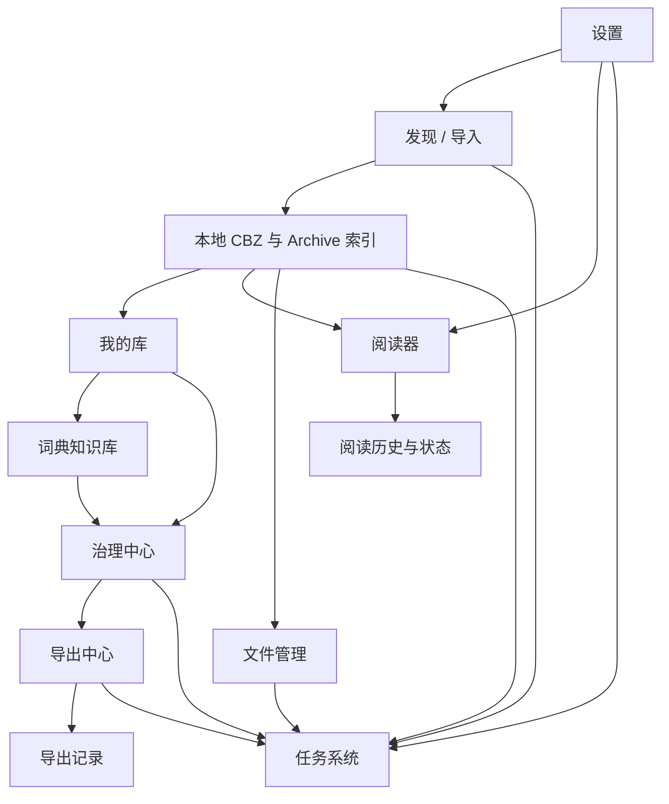
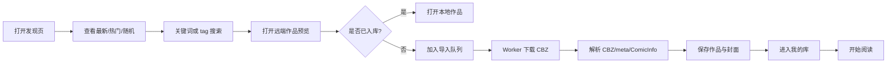
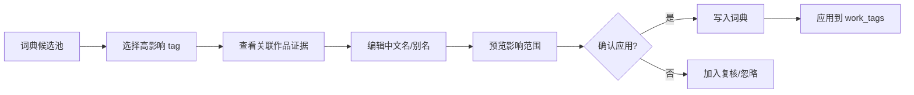
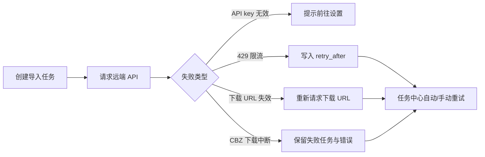
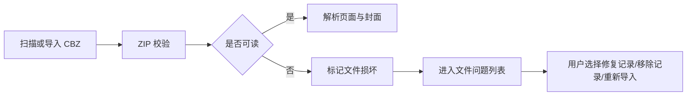
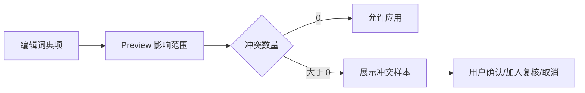

# NH Archive 产品设计流程文档

> 版本：v0.2
> 最近复核：2026-06-13
> 目标：将 `nhentai-archive` 从“元数据管理网页”升级为“阅读、拉取、管理、治理一体化的个人同人志漫画站”。  
> 后续用途：作为 UI 设计图、生图提示词、前端重构、后端接口重构、产品路线规划和 AI 续作交接的统一依据。

---

## 0. 核心结论

NH Archive 后续不应继续被定义为“metadata manager”。元数据管理只是整个产品中的一个治理子系统。

新的产品定义应该是：

> **Local-first Personal Doujin Platform**  
> 一个本地优先的个人同人志馆藏平台，集远端发现、CBZ 拉取、本地阅读、tag 中文化、文件管理、metadata 治理、词典治理、导出归档于一体。

它最终要替代的不是“后台表格”，也不只是“nhentai 的下载器”，而是成为用户自己的私人漫画站。

### 0.1 文档定位

本文件是完整产品蓝图：已完成模块仍保留在流程中，用于解释产品主线、模块依赖和后续演进；当前进度不在这里展开，详见 `docs/PROJECT_STATUS.md`。后续 AI 阅读顺序：

```text
PROJECT_STATUS.md -> PROJECT_MAP.md -> DEVELOPMENT_RULES.md -> 本文件 -> 对应 design/*.png
```

### 0.2 决策优先级

```text
真实数据与本地安全 > 阅读/导入主线可用 > 隐私默认可靠 > 设计图一致 > 高级治理能力
```

未实现模块可以出现在流程和导航中，但必须明确边界；禁止用假作品、假统计、假任务或假导出记录制造完成感。

---

## 1. 产品愿景

### 1.1 目标形态

最终平台应同时承担四种角色：

```text
1. 私人漫画站
   - 本地馆藏浏览
   - 在线阅读 CBZ
   - 阅读进度、历史、收藏、状态

2. nhentai 私有前端
   - 最新作品
   - 热门作品
   - 随机作品
   - 远端搜索
   - tag 检索
   - 相关作品
   - 一键拉取入库

3. 同人志档案管理器
   - CBZ 文件入库
   - 文件扫描
   - 文件去重
   - 封面缓存
   - 导出 CBZ
   - 原始文件与导出文件分离

4. 元数据与语义治理系统
   - ComicInfo.xml 编辑
   - meta.json 对照
   - tag 治理
   - 中文词典
   - 机器翻译建议
   - 多 tag 语义映射
```

### 1.2 产品关键词

```text
本地优先
私人馆藏
同人志友好
中文 tag 体验
远端发现
可阅读
可治理
可导出
可回溯
隐私优先
```

### 1.3 不做什么

短期不应该追求：

```text
- 完整复刻 nhentai 社区功能
- 复杂评论系统
- 公共用户系统
- 社交推荐
- 站点级开放发布
- 未经缓存和治理的无限远端瀑布流
```

它的核心是“个人私有站”，不是公开社区。

---

## 2. 设计总原则

### 2.1 Local-first

所有长期价值都应该沉淀到本地：

```text
远端数据 -> 本地缓存
远端 tag -> 本地 tag knowledge base
远端封面 -> 本地封面缓存
远端作品 -> 本地 CBZ
远端搜索结果 -> 可复用缓存
用户治理结果 -> 本地最终数据
```

远端 API 是来源，不是平台本身。

### 2.2 阅读优先，不是管理优先

旧目标是“管理作品”。新目标是“拥有一个可以阅读和整理的私人漫画站”。

因此页面优先级应改变：

```text
以前：搜索 / 库 / 详情 / 词典 / 队列 / 设置
以后：发现 / 我的库 / 阅读 / 治理 / 词典 / 文件 / 队列 / 设置
```

### 2.3 艺术风格服务于工作流

用户喜欢的方向是“图二”那种艺术馆藏风：

```text
- 暖纸白背景
- 大标题
- 日系编辑感
- 精致封面墙
- 黑色主文字
- 陶土红强调
- 私人收藏馆氛围
```

但不能为了好看牺牲操作效率。不同页面应该有不同视觉密度：

```text
发现页：取材台，适合浏览和导入
我的库：私人馆藏墙，适合筛选和继续阅读
阅读器：沉浸阅读，隐藏管理 UI
治理页：编辑工坊，高密度但清晰
词典页：语义资料库，证据驱动
文件页：资料库维护台，偏工具化
```

### 2.4 成人内容隐私优先

这是成人同人志平台，不是普通漫画站。

必须内建隐私模式：

```text
- 封面模糊
- 标题脱敏
- 快速锁定
- 浏览器标题隐藏作品名
- 默认低调模式
- 缩略图安全模式
- 阅读器快速遮罩
```

隐私不是装饰，而是核心体验。

### 2.5 远端能力必须被后端封装

前端不应该直接理解 nhentai API 的复杂性。

```text
前端只调用：/api/discover/*
后端负责：
  - 请求 nhentai
  - CDN 解析
  - 下载 URL 获取
  - 429 退避
  - 缓存
  - 中文 tag 映射
  - 返回统一结构
```

### 2.6 真实数据、状态与文档同步

| 规则 | 要求 |
|---|---|
| 数据真实性 | 页面数据必须来自真实 API、SQLite、文件系统、远端 API 或用户导入 CBZ。 |
| 禁止伪完成 | 禁止硬编码作品、模拟任务、随机统计、假 tag 候选、假导出记录。 |
| 允许状态 | 空状态、加载状态、错误状态、配置提示、明确的“未接入真实能力”。 |
| 敏感内容 | 不内置成人样例图；背景、线稿、空状态插画必须非露骨。 |
| 文档同步 | 完成真实模块后同步 `PROJECT_STATUS.md`、`PROJECT_MAP.md`，必要时更新 `DEVELOPMENT_RULES.md`。 |

---

## 3. 整体信息架构

### 3.1 推荐导航

```text
发现
我的库
阅读历史
治理中心
词典
文件
任务
设置
```

如果需要更接近当前项目，可过渡为：

```text
工作台
发现 / 导入
我的库
阅读
治理
词典
队列
导出
设置
```

### 3.2 一级模块说明

| 模块 | 主要职责 | 页面气质 |
|---|---|---|
| 发现 | 获取最新、热门、随机、搜索、tag 查询、导入远端作品 | 取材台 / 发现页 |
| 我的库 | 浏览本地馆藏、筛选、继续阅读、批量操作 | 私人馆藏墙 |
| 阅读 | CBZ 在线阅读、进度、历史、收藏 | 沉浸阅读器 |
| 治理 | metadata、tag、ComicInfo、导出前确认 | 编辑工坊 |
| 词典 | 中文 tag、英文远端 tag、别名、证据、机器建议 | 语义资料库 |
| 文件 | 本地 CBZ、导出文件、封面缓存、重复/损坏/孤儿文件 | 资料库维护台 |
| 任务 | 下载、扫描、解析、导出、翻译、失败重试 | 任务时间线 |
| 设置 | 数据源、翻译、路径、隐私、安全、维护 | 偏好设置 |

### 3.3 模块依赖关系

模块不是平行堆叠，而是逐层支撑。



因此阶段顺序不能随意跳：

```text
没有 Archive 索引，就不能做真正的库和阅读。
没有词典，就不能做高质量中文 tag 搜索和批量 tag 治理。
没有治理结果，就不能做可靠导出 preview。
没有文件扫描，就不能做健康检查、重复检查和清理。
没有统一任务系统，就不能让下载、解析、导出、扫描长期可靠。
```

### 3.4 导航与真实能力边界

导航可以展示完整产品结构，但页面能力必须诚实。

| 状态 | 使用条件 |
|---|---|
| 可操作 | 已有真实 API / 数据库查询 / 文件操作。 |
| 边界提示 | 路线已确定，但服务未实现；例如导出中心未有 `ExportService` 时只能说明未接入。 |
| 禁用 | 高风险写操作、外部配置缺失或当前无法安全执行。 |

---

## 4. 核心用户流程

### 4.1 远端发现到本地阅读



### 4.2 本地文件入库到治理


### 4.3 中文 tag 搜索远端作品


### 4.4 阅读到治理闭环


### 4.5 词典治理到批量应用



### 4.6 失败与恢复流程

真实个人资料库长期运行时，失败路径和成功路径同等重要。

#### 远端导入失败



#### 本地文件损坏



#### 词典批量应用风险



失败状态必须写入数据库或任务记录，不能只在前端 toast 中消失。

---

## 5. 远端发现设计

### 5.1 目标

让用户不必打开 nhentai，也能在本平台完成：

```text
- 看最新
- 看热门
- 随机发现
- 搜索关键词
- tag 查询
- 中文 tag 选择
- 多条件筛选
- 预览详情
- 一键入库
```

### 5.2 API 能力映射

| 需求 | 远端 API 能力 | 可行性 | 说明 |
|---|---|---:|---|
| 最新作品 | `GET /api/v2/galleries` | 高 | 按 newest 分页 |
| 热门作品 | `GET /api/v2/galleries/popular` | 高 | 今日热门 |
| 随机作品 | `GET /api/v2/galleries/random` | 高 | 返回随机 gallery ID |
| 作品详情 | `GET /api/v2/galleries/{id}` | 高 | 返回 title、cover、tags、pages、related 等 |
| 相关作品 | `GET /api/v2/galleries/{id}/related` | 高 | 可用于预览页 |
| 下载 CBZ | `POST /api/v2/galleries/{id}/download` | 高但受限 | 短期 URL，需 API key 和限流处理 |
| 单 tag 搜索 | `GET /api/v2/galleries/tagged?tag_id=` | 高 | 远端明确支持单 tag_id |
| tag autocomplete | `POST /api/v2/tags/search` | 高 | 按英文 name prefix 搜索 |
| 多 tag 组合 | 未见明确专用接口 | 中 | 需 query 拼接、缓存交集或本地索引 |
| 中文 tag 搜索 | 远端不支持 | 中高 | 必须靠本地词典映射英文/tag_id |

### 5.3 发现页结构

```text
顶部全局栏
  Logo / 搜索 / 队列 / 隐私 / 导入 / 用户

页面标题区
  发现 / 导入
  从远端源发现同人志，支持画廊 ID、批量 ID、CBZ 上传与目录扫描

模式切换
  最新 / 热门 / 随机 / 远端搜索 / 画廊 ID / 批量 ID / 上传 CBZ / 扫描目录

搜索与筛选区
  关键词
  中文 tag selector
  语言
  类型
  排序
  是否仅显示未入库

结果区
  封面卡片
  入库状态
  预览 / 导入 / 打开本地

预览层
  封面
  标题
  ID
  页数
  tags
  相关作品
  导入按钮

底部任务坞站
  下载 / 解析 / 入库进度
```

### 5.4 极短关键词搜索策略

远端短关键词搜索必须限制，否则会造成无意义大结果、频繁请求和前端渲染压力。

建议规则：

```text
0 字符：展示最新/热门，不触发搜索
1 字符：只查本地历史、词典、tag autocomplete，不查远端 gallery
2 字符：允许 tag autocomplete，不自动查 gallery，用户按 Enter 才查
3 字符及以上：允许远端 gallery search
```

前端策略：

```text
- 输入防抖 300-500ms
- AbortController 取消旧请求
- 每页 25 或 50
- 虚拟网格渲染
- 图片懒加载
- 远端结果缓存
```

后端策略：

```text
- search_cache
- remote request rate limit
- 429 标准化错误
- 相同 query 短期复用
- 结果只返回统一 GallerySummary
```

---

## 6. 中文 tag 与多 tag 筛选设计

### 6.1 目标

用户使用中文思考：

```text
少女
碧蓝档案
某作者中文译名
```

但远端 API 使用英文 tag/name/slug/id。

所以需要中间层：

```text
中文显示 -> 本地词典 -> remote tag id / slug / english name -> API 请求
```

### 6.2 Tag Knowledge Base

建议将现有词典升级为 tag 知识库。

```sql
remote_tags
  id
  remote_id
  type
  name
  slug
  url
  count
  description
  source
  last_seen_at

local_tag_dictionary
  id
  remote_tag_id
  type
  source_text
  display_zh
  aliases
  confidence
  locked
  ignored
  created_at
  updated_at

tag_aliases
  id
  tag_id
  alias
  lang
  normalized
```

### 6.3 Tag selector 交互

用户输入中文：

```text
少女
```

候选结果显示：

```text
少女    tag:yuri    远端 tag_id:xxx
少女漫画  本地别名
少女爱   alias
```

选中后 chip 显示：

```text
少女
```

实际 query 使用：

```json
{
  "display": "少女",
  "remote_id": 123,
  "remote_name": "girl",
  "type": "tag"
}
```

### 6.4 多 tag 查询方案

#### 方案 A：远端 search query 拼接

```text
tag:yuri language:japanese artist:xxx
```

优点：体验好。  
风险：需要确认远端 search 语法是否完整支持。

#### 方案 B：单 tag 查询 + 后端交集

```text
GET /galleries/tagged?tag_id=A
GET /galleries/tagged?tag_id=B
GET /galleries/tagged?tag_id=C
后端取交集
```

优点：基于明确 API。  
缺点：请求多、分页复杂、受限流影响。

#### 方案 C：本地远端索引缓存

```text
remote_galleries
remote_gallery_tags
remote_search_cache
```

优点：长期体验最好。  
缺点：需要逐步积累缓存。

#### 推荐策略

```text
短期：单 tag + 关键词 + 中文映射
中期：query 拼接 + 失败 fallback
长期：remote cache + 本地索引交集
```

---

## 7. 我的库设计

### 7.1 目标

我的库不是后台列表，而是私人漫画站首页。

它应支持：

```text
- 浏览本地 CBZ 馆藏
- 继续阅读
- 最近添加
- 最近阅读
- 按 tag/作者/社团筛选
- 管理阅读状态
- 进入治理
- 批量操作
```

### 7.2 页面结构

```text
顶部全局栏
页面标题：我的库
馆藏摘要：总数 / 已读 / 阅读中 / 待治理 / 容量
筛选图谱：语言 / 状态 / 来源 / tag / 作者 / 社团 / 页数 / 导出状态
视图切换：封面墙 / 书架 / 紧凑 / 表格
封面墙：作品卡片
浮动 Inspector：选中作品详情
底部批量托盘：选中作品后出现
任务坞站：全局底部
```

### 7.3 卡片信息层级

默认显示：

```text
封面
标题
作者/社团
语言
页数
阅读状态
治理状态
R-18/全年龄小徽章
```

Hover 显示：

```text
继续阅读
进入治理
应用词典
导出 CBZ
更多
```

选中后底部出现：

```text
已选择 N 项
批量编辑 / 批量标签 / 批量状态 / 批量导出 / 删除
```

### 7.4 我的库不应该承担的职责

```text
- 不在库页做深度 metadata 编辑
- 不在库页逐条确认 tag
- 不在库页配置复杂导出规则
- 不在库页写词典
```

库页负责入口和批量轻操作，深度工作进入治理/词典/导出中心。

---

## 8. 阅读器设计

### 8.1 阅读器定位

阅读器是平台成为“个人漫画站”的关键。它应该是一等模块，不是文件预览。

### 8.2 MVP 功能

```text
- 单页阅读
- 连续滚动阅读
- 宽度适配
- 高度适配
- 上一页 / 下一页
- 键盘方向键
- 当前页码
- 阅读进度保存
- 继续阅读
- 标记已读
- 收藏
- 从阅读器进入治理
```

### 8.3 后端接口建议

```http
GET /api/works/{id}/pages
GET /api/works/{id}/pages/{page_index}
GET /api/works/{id}/reader-state
PATCH /api/works/{id}/reader-state
POST /api/works/{id}/reader-events
```

### 8.4 数据模型建议

```sql
reader_progress
  id
  work_id
  user_id
  page_index
  page_count
  progress_percent
  completed
  last_read_at

reading_history
  id
  work_id
  user_id
  page_index
  opened_at
```

### 8.5 页面图片加载策略

不要一次性加载所有页面。

```text
当前页
前 2 页
后 4 页
```

按需加载，滚动模式也要分页预取。

### 8.6 隐私交互

```text
- 快捷键隐藏画面
- 离开窗口自动遮罩，可选
- 顶部栏默认隐藏
- 鼠标移动显示控件
- 浏览器标题默认不显示作品名，可选
```

---

## 9. 治理中心设计

### 9.1 目标

治理不应该只是作品详情页，而应该是一个连续处理队列。

用户打开治理中心时看到：

```text
待补 metadata
待确认 tag
词典冲突
机翻建议待采用
缺 ComicInfo
缺封面
可导出
导出失败
```

### 9.2 新接口建议

```http
GET /api/governance/queue
GET /api/works/{id}/governance
POST /api/works/{id}/governance/apply
POST /api/governance/bulk-preview
POST /api/governance/bulk-apply
```

### 9.3 `GET /api/works/{id}/governance` 返回结构

```json
{
  "work": {},
  "files": [],
  "metadata": {
    "original": {},
    "working": {},
    "diff": []
  },
  "tags": {
    "groups": [],
    "summary": {
      "confirmed": 0,
      "pending": 0,
      "conflicts": 0
    }
  },
  "dictionary": {
    "matched": 0,
    "pending": 0,
    "conflicts": 0
  },
  "exports": [],
  "recommended_actions": []
}
```

### 9.4 治理页结构

```text
顶部作品抬头
  封面 / 标题 / ID / 来源 / 文件 / 页数 / 大小 / 完整度

左侧：ComicInfo 对照编辑器
  当前值
  来源值
  机翻建议
  差异提示
  采用来源值 / 使用机翻 / 恢复

右侧：Tag 治理板
  作者与社团
  原作与角色
  内容标签
  语言与分类
  其他

底部操作带
  保存修改 / 应用词典 / 生成机翻建议 / 重新解析 / 导出 CBZ
```

### 9.5 Metadata 字段建议

每个字段不要只是字符串，而要有来源状态：

```json
{
  "field": "language",
  "current": "日语",
  "source_value": "japanese",
  "source": "meta_json",
  "confidence": 0.92,
  "dirty": false,
  "suggestions": [
    {"source": "dictionary", "value": "日语"},
    {"source": "machine", "value": "日本語"}
  ]
}
```

---

## 10. 词典治理设计

### 10.1 目标

词典不只是翻译表，而是中文化和远端查询的核心基础设施。

它服务于：

```text
- 本地 tag 展示
- 本地 tag 筛选
- 远端中文 tag 搜索
- metadata 导出
- 机器建议校正
- 多 tag 查询
```

### 10.2 页面结构

```text
顶部摘要
  未配置 / 已配置 / 已忽略 / 待复核 / 机器建议

左：候选术语池
  类型 / 原文 / 建议翻译 / 影响作品数 / 状态

中：术语编辑器
  类型 / 原文 / 中文 / 别名 / 备注 / 适用范围
  机器建议
  写入词典 / 保存修改 / 忽略 / 加入复核

右：证据面板
  关联作品
  常见搭配 tag
  历史记录
  远端 tag 信息
```

### 10.3 词典写入前必须 preview

```http
POST /api/dictionary/preview-apply
POST /api/dictionary/apply
```

Preview 返回：

```json
{
  "will_update_tags": 642,
  "will_update_works": 128,
  "conflicts": 12,
  "ignored": 0,
  "samples": []
}
```

避免一个词典修改污染大量作品。

---

## 11. 文件管理设计

### 11.1 目标

让平台不仅能导入和阅读，还能长期维护本地资料库。

### 11.2 页面模块

```text
文件浏览
  原始 CBZ
  导出 CBZ
  封面缓存
  页面缓存

健康检查
  损坏 archive
  缺失封面
  缺失文件
  孤儿记录
  孤儿文件

重复检查
  hash 相同
  gallery id 相同
  标题高度相似

清理工具
  清理 tmp
  清理失效封面
  清理旧导出
```

### 11.3 后端接口建议

```http
GET /api/files/overview
GET /api/files/issues
POST /api/files/scan-health
POST /api/files/cleanup-preview
POST /api/files/cleanup
GET /api/files/duplicates
```

---

## 12. 任务系统设计

### 12.1 目标

统一所有耗时动作：

```text
远端下载
本地上传
目录扫描
CBZ 解析
缩略图生成
词典应用
机翻建议
导出 CBZ
重新解析
文件健康检查
```

### 12.2 推荐统一 Job 模型

```http
POST /api/jobs
GET /api/jobs
GET /api/jobs/{id}
POST /api/jobs/{id}/pause
POST /api/jobs/{id}/resume
POST /api/jobs/{id}/retry
DELETE /api/jobs/{id}
```

### 12.3 Job 返回结构

```json
{
  "id": 1,
  "type": "remote_import",
  "status": "running",
  "stage": "downloading",
  "progress": {
    "current": 18,
    "total": 120,
    "percent": 15
  },
  "target": {
    "gallery_id": 123456,
    "work_id": null,
    "file": "xxx.cbz"
  },
  "error": null,
  "retry_after": null
}
```

### 12.4 UI 表现

全局底部任务坞站：

```text
任务中心 3
导入文件 4/8
解析中 3/5
导出 CBZ 2/4
查看全部任务
```

任务页：

```text
正在运行
等待中
失败
已完成
导出记录
```

失败任务要给出可读解决方案：

```text
远端限流：预计 60 秒后自动重试
API Key 无效：前往设置检查
文件损坏：查看解析日志
路径不存在：重新选择目录
```

---

## 13. 导出设计

### 13.1 目标

导出不是一个按钮，而是归档流程。

### 13.2 导出中心

```text
导出记录
导出预设
批量导出
失败重试
输出目录
命名规则
ComicInfo 写入规则
meta.json 保留规则
```

### 13.3 导出前 preview

```http
POST /api/exports/preview
POST /api/exports
```

Preview 返回：

```json
{
  "items": [
    {
      "work_id": 1,
      "output_name": "xxx.cbz",
      "warnings": ["7 个 tag 未确认", "缺少 Writer 字段"],
      "will_write": ["ComicInfo.xml"],
      "will_keep": ["meta.json"],
      "will_not_modify": ["original.cbz"]
    }
  ]
}
```

UI 必须明确：

```text
将生成新 CBZ
将写入 ComicInfo.xml
默认保留 meta.json
不会修改原始 CBZ
```

---

## 14. 后端架构重构建议

### 14.1 逻辑分层

即使暂时仍在 `server/main.go`，也应按概念分层：

```text
DiscoverService
  latest / popular / random / search / tag search / query

RemoteCacheService
  remote galleries / tags / search cache

ImportService
  remote import / local upload / local scan

LibraryService
  works / covers / files / summaries

ReaderService
  pages / reader state / history

GovernanceService
  metadata diff / tag governance / dictionary apply

DictionaryService
  tag knowledge base / aliases / suggestions / evidence

ExportService
  preview / export / records / rerun

JobService
  unified tasks/jobs
```

### 14.2 新增接口优先级

第一批：发现页

```http
GET /api/discover/latest
GET /api/discover/popular
GET /api/discover/random
GET /api/discover/search
GET /api/discover/galleries/{id}
POST /api/discover/galleries/{id}/import
GET /api/discover/tags/autocomplete
POST /api/discover/query
```

第二批：阅读器

```http
GET /api/works/{id}/pages
GET /api/works/{id}/pages/{page_index}
GET /api/works/{id}/reader-state
PATCH /api/works/{id}/reader-state
```

第三批：治理聚合

```http
GET /api/governance/queue
GET /api/works/{id}/governance
POST /api/works/{id}/governance/apply
```

第四批：词典与导出 preview

```http
POST /api/dictionary/preview-apply
POST /api/dictionary/apply
POST /api/exports/preview
POST /api/exports
```

第五批：统一任务

```http
POST /api/jobs
GET /api/jobs
POST /api/jobs/{id}/retry
POST /api/jobs/{id}/pause
POST /api/jobs/{id}/resume
```

---

## 15. 前端结构建议

```text
frontend/src/components/
  layout/
    ArchiveShell.tsx
    TopNav.tsx
    TaskDock.tsx
    PrivacyControls.tsx

  discover/
    DiscoverTabs.tsx
    RemoteSearchPanel.tsx
    TagSelector.tsx
    GalleryResultCard.tsx
    GalleryPreviewDrawer.tsx

  library/
    CoverWall.tsx
    WorkCard.tsx
    FilterRibbon.tsx
    WorkInspector.tsx
    BulkActionTray.tsx

  reader/
    ReaderShell.tsx
    PageCanvas.tsx
    ReaderToolbar.tsx
    ReaderProgress.tsx

  governance/
    GovernanceQueue.tsx
    WorkSummaryStrip.tsx
    MetadataDiffEditor.tsx
    TagGovernanceBoard.tsx
    ExportPreviewDrawer.tsx

  dictionary/
    CandidatePool.tsx
    TermEditor.tsx
    EvidencePanel.tsx
    DictionaryApplyPreview.tsx

  files/
    FileOverview.tsx
    DuplicatePanel.tsx
    CleanupPreview.tsx

  tasks/
    TaskDockItem.tsx
    TaskTimeline.tsx
```

页面文件保持薄：

```text
DiscoverPage.tsx
LibraryPage.tsx
ReaderPage.tsx
GovernancePage.tsx
DictionaryPage.tsx
FileManagerPage.tsx
TasksPage.tsx
SettingsPage.tsx
```

页面负责组合组件，不负责堆业务逻辑。

---

## 16. 性能策略

### 16.1 封面墙

```text
- 虚拟网格
- 图片 lazy loading
- 固定缩略图尺寸
- 后端生成缩略图
- 避免一次渲染上千卡片
- 结果分页或无限滚动
```

### 16.2 远端搜索

```text
- query debounce
- AbortController
- min query length
- per_page 25/50
- search cache
- rate limit UI 提示
```

### 16.3 阅读器

```text
- 只预加载当前页附近
- 滚动模式按段加载
- 图片对象及时释放
- 移动端降级预览
```

### 16.4 tag selector

```text
- 本地词典优先
- 远端 tag search 限 limit
- 中文 alias 建索引
- 结果按使用频率排序
```

---

## 17. 隐私与安全设计

### 17.1 顶部常驻控件

```text
隐私模式
封面模糊
快速锁定
队列状态
```

### 17.2 设置项

```text
privacy.default_mode
privacy.blur_covers
privacy.mask_titles
privacy.auto_lock_minutes
privacy.safe_window_title
privacy.hide_recent_on_home
```

### 17.3 页面行为

```text
发现页：可隐藏成人封面，只显示占位
我的库：支持低调模式
阅读器：可一键遮罩
任务栏：不显示敏感标题，可选
浏览器标题：默认 NH Archive，不显示作品名
```

---

## 18. 视觉设计方向

后续设计图统一沿用“图二”方向，但做成完整产品系统。

### 18.1 风格名

```text
Doujin Archive Gallery
同人志私人档案馆
```

### 18.2 视觉关键词

```text
暖纸白
黑色大标题
陶土红
日系编辑感
私人收藏馆
精致封面墙
低饱和
克制但大胆
```

### 18.3 推荐色彩

```text
背景：#F6F1E8 / #F3EDE2
主文字：#1D1A16
次文字：#6F675D
边框：#DDD3C4
主强调：#A83224 / #B6422E
辅助强调：#315B4E
警告：#C58A2E
成功：#567D56
危险：#9F2F25
```

### 18.4 模块视觉差异

| 模块 | 视觉气质 |
|---|---|
| 发现 | 取材、检索、轻冒险感 |
| 我的库 | 私人收藏馆、大封面墙 |
| 阅读 | 沉浸、低干扰、深浅主题可切 |
| 治理 | 编辑工房、表单与证据清晰 |
| 词典 | 资料库、语义证据、专业感 |
| 文件 | 维护工具、清晰、可靠 |
| 任务 | 时间线、进度、可恢复 |

### 18.5 现有设计图复核

当前 `design/` 已包含九张 1448 x 1086 桌面设计图，足够作为第一轮桌面端高保真基准。后续开发不应凭空发明主布局，应先复核下表：

| 设计图 | 已确定结构 | 需要开发时补足 |
|---|---|---|
| 搜索导入 | 顶部双层导航、模式 tab、筛选条、结果网格、右侧详情、底部任务坞站 | 中文 tag selector、批量 ID、上传 CBZ、扫描目录 |
| 库 | 馆藏摘要、筛选图谱、封面墙、右侧 Inspector、底部批量托盘 | 真正的 tag/作者/社团筛选、批量操作写入 |
| 阅读 | 左目录、中阅读画布、顶部阅读工具条、右信息/设置、底部历史/笔记/相关作品 | 不一次性加载所有页缩略图、阅读历史列表、笔记接口 |
| 元数据 | 作品抬头、ComicInfo 对照表、tag 治理板、右侧质量面板、底部操作条 | Governance aggregate、metadata diff、保存策略 |
| 词典 | 顶部指标、候选池、术语编辑器、证据面板、应用预览 | 词典表、alias、preview/apply、冲突处理 |
| 导出中心 | 导出统计、待导出列表、导出预设、右侧预览、导出记录 | 生成新 CBZ、不修改原始 CBZ、导出任务 |
| 文件管理 | 文件统计、文件表、健康检查、重复检查、清理工具 | 文件系统扫描、孤儿文件、重复 hash、清理 preview |
| 任务中心 | 任务统计、任务表、右侧任务详情、错误提示、操作按钮 | pause/resume/cancel、日志、可恢复状态机 |
| 设置 | 左侧设置分类、连接/路径/隐私/维护表单、右侧摘要 | 敏感值不回显、路径校验、缓存限制、重启提示 |

### 18.6 设计质量门槛

每个页面完成前检查：布局贴图、密度贴图、数据真实、状态完整、隐私可控、红色主按钮只用于高意图操作、未实现能力有边界、移动端不溢出。

### 18.7 创意方向

可逐步加入：私人藏书票、阅读书签、治理工单、词典证据链、导出封签、隐私剧场模式、档案健康分。创意必须服务主流程，不能变成装饰性噪音。

---

## 19. 设计图维护与新增规范

### 19.1 已有设计图

已有高保真桌面图覆盖：发现 / 导入、我的库、阅读器、作品治理、词典治理、文件管理、任务中心、设置、导出中心。

后续不应重新发明整体风格。只有在以下情况才需要新增设计图：

新增设计图只用于：移动端、弹窗/抽屉/空状态/错误状态、批量操作复杂流程、现有图未覆盖模块、实现与设计冲突后的重新决策。

### 19.2 新增设计图约束

```text
高保真桌面网页 UI；真实产品截图感；暖纸白、黑字、陶土红、日系编辑感；
顶部导航 + 页面局部结构；中文 UI 文案；成人内容只用 R-18/隐私/模糊机制表达；
必须包含真实操作状态；不使用假作品、假统计、假任务；未实现模块表达边界或空状态。
```

### 19.3 各图复核重点

#### 发现页

```text
最新/热门/随机/远端搜索/tag selector/导入队列/远端预览
```

#### 我的库

```text
封面墙/筛选图谱/继续阅读/治理状态/隐私模式/批量托盘
```

#### 阅读器

```text
沉浸阅读/页码/进度/阅读设置/快速治理入口/隐私遮罩
```

#### 作品治理

```text
ComicInfo 对照编辑器/tag 治理板/导出预览/完整度
```

#### 词典治理

```text
候选池/术语编辑器/远端 tag 映射/关联作品证据/应用预览
```

---

## 20. 分阶段实现路线

### Phase 0：真实闭环基线

目标：证明平台不是静态壳，而是能真实完成发现到阅读。

```text
- discover API 聚合层
- remote import job
- CBZ 下载与本地保存
- Archive 索引
- Library 真实列表
- Reader 页面读取
- Reader progress 保存
```

验收标准：

```text
配置 API key 后可以搜索/预览/导入真实 gallery。
导入后可以从我的库进入阅读器。
阅读页码变化会保存，下次打开可恢复。
没有内置成人样例图、假作品、假任务。
```

### Phase 1：设计基线重写

目标：让真实闭环服从 `design/` 的产品形态。

```text
- 全局顶部栏与二级导航
- 发现页左右结构
- 我的库封面墙与 Inspector
- 阅读器左目录 / 中画布 / 右设置
- 任务中心真实列表
- 设置页安全摘要
- 未实现模块边界页
```

验收标准：

```text
发现 / 库 / 阅读 / 任务 / 设置与设计图结构一致。
未实现模块不展示假数据。
PROJECT_STATUS / PROJECT_MAP / DEVELOPMENT_RULES 同步更新。
```

### Phase 2：中文 tag selector 与词典基础

目标：让中文成为远端发现、本地筛选和治理的共同入口。

```text
- local_tag_dictionary
- tag_aliases
- work_tags
- DictionaryService autocomplete
- 远端 tag 映射
- preview-apply
- apply 到 work_tags
- 发现页中文 tag selector
- 库页中文 tag 筛选
```

验收标准：

```text
输入中文能命中本地词典和 alias。
选中 tag 能映射到 remote tag id 或本地 work_tags。
词典应用前必须看到影响范围和冲突样本。
```

### Phase 3：我的库增强

目标：把库从封面墙升级为私人馆藏工作台。

```text
- 本地搜索
- 阅读状态筛选
- 来源筛选
- tag/作者/社团筛选
- 继续阅读区
- 最近阅读 / 最近添加
- 轻量批量操作
```

验收标准：

```text
所有结果来自 SQLite。
空库和空结果清楚区分。
筛选组合可复现，不依赖前端硬编码。
```

### Phase 4：治理中心

目标：把 metadata、ComicInfo、tag 冲突变成可连续处理的治理队列。

```text
- governance queue
- work governance aggregate
- metadata diff editor
- tag governance board
- dictionary apply entry
- recommended actions
```

验收标准：

```text
每个字段能说明当前值、来源值、建议值和差异。
保存修改写入本地最终数据。
治理完成度可被库页和导出中心读取。
```

### Phase 5：导出中心

目标：以归档流程生成新 CBZ，不破坏原始文件。

```text
- export preview
- export presets
- export job
- export records
- ComicInfo.xml 写入
- meta.json 保留策略
```

验收标准：

```text
preview 明确输出名、warnings、will_write、will_keep、will_not_modify。
导出生成新 CBZ。
原始 CBZ 不被修改。
失败可在任务中心重试。
```

### Phase 6：文件维护与任务系统完善

目标：让平台适合长期运行。

```text
- file overview
- health scan
- duplicate scan
- orphan record/file detection
- cleanup preview
- job pause/resume/cancel
- job logs
```

验收标准：

```text
文件统计来自真实文件系统和数据库。
清理前必须 preview。
任务状态流转可恢复，不靠前端假进度。
```

### Phase 7：工作台与体验深化

目标：形成日常入口，而不是只是一组模块页面。

```text
- 今日继续阅读
- 最近导入
- 待治理队列摘要
- 失败任务摘要
- 文件健康摘要
- 快速隐私模式
- 馆藏健康分
```

验收标准：

```text
工作台只聚合真实模块数据。
没有真实来源的指标不显示。
用户能从工作台进入发现、阅读、治理、任务和文件维护。
```

---

## 21. 当前最重要的产品决策

### 21.1 本地搜索和远端搜索必须分开

本地搜索可以非常强：

```text
中文 tag
英文 tag
作者
社团
标题
文件名
阅读状态
治理状态
导出状态
多 tag AND/OR/NOT
```

远端搜索受 API 限制，应更保守：

```text
关键词
最新
热门
随机
单 tag
部分多 tag
```

### 21.2 远端数据必须缓存

如果没有缓存，多 tag 查询、相关作品、中文 tag 体验都会不稳定。

### 21.3 词典是平台壁垒

词典不只是导出用翻译，而是连接这些东西的中枢：

```text
中文 UI
英文远端 API
tag 治理
本地筛选
阅读展示
导出 ComicInfo
```

### 21.4 阅读器应尽早做 MVP

只做治理会让产品继续偏工具。阅读器上线后，产品定位才真正改变。

---

## 22. 最终目标图景

```text
发现页像 nhentai，但更私密、更中文、更可控。
我的库像 Kavita/Komga，但更懂同人志 tag 和来源。
阅读器像专业漫画阅读器，但和治理系统相连。
治理页比普通漫画站更强，能处理 metadata、tag、ComicInfo、导出。
词典页是核心资产，让中文搜索和英文 API 打通。
文件和任务系统保证长期使用不崩。
```

最终 NH Archive 应该成为：

> **可以完全替代 nhentai 日常浏览、拉取、阅读、整理需求的个人漫画站。**

---

## 23. 下一步建议

马上不要继续只修 metadata UI，也不要在视觉未对齐时继续堆后续模块。建议顺序：

```text
1. 用现有九张设计图人工复核当前实现
2. 修正发现 / 我的库 / 阅读器 / 任务 / 设置的视觉差距
3. 更新 PROJECT_STATUS 和 PROJECT_MAP
4. 开发中文 tag selector 与词典基础
5. 让库页筛选接入真实 work_tags
6. 开发治理中心 aggregate 和 metadata diff
7. 开发导出 preview，再做真实导出任务
8. 最后补文件维护、任务控制和工作台总览
```

这样产品主线会从“管理工具”转向“个人漫画站”。

### 23.1 下一位 AI 的第一步

后续 AI 接手时，不要先全仓库搜索。按顺序读取：

```text
1. docs/PROJECT_STATUS.md
2. docs/PROJECT_MAP.md
3. docs/DEVELOPMENT_RULES.md
4. design/nh_archive_product_design_flow.md
5. 当前要做模块对应的 design/*.png
```

模块入口：词典看 `design/词典.png` + 第 6/10 章 + Phase 2；治理看 `design/元数据.png` + 第 9 章 + Phase 4；导出看 `design/导出中心.png` + 第 13 章 + Phase 5；文件看 `design/文件管理.png` + 第 11 章 + Phase 6。

### 23.2 文档维护规则

维护分工：

```text
产品原则、模块设计、阶段顺序 -> 本文件
当前做到哪里、下一步做什么 -> PROJECT_STATUS.md
代码在哪里、接口怎么走 -> PROJECT_MAP.md
开发禁令和数据真实性 -> DEVELOPMENT_RULES.md
```

实现与本文冲突时：临时技术限制写入 `PROJECT_STATUS.md`；设计过时则更新本文件；只是为了省事则修实现，不改原则。
